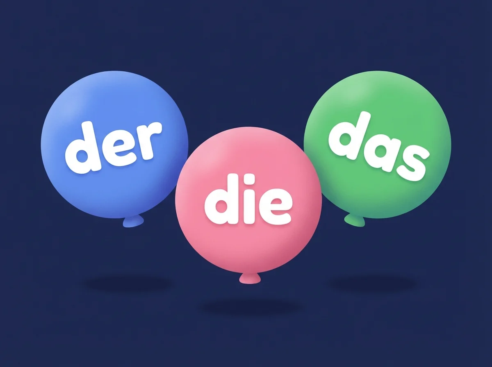

# Doiti - German Grammar Practice

<p align="center">
  
</p>

<p align="center">
  A free, offline app to practice German grammar. Works on Android and the web.
</p>

<p align="center">
  <a href="https://bruno1308.github.io/doiti/">Try it in your browser</a>
</p>

---

## Practice Modes

<table>
  <tr>
    <td align="center"><br/><b>Der/Die/Das</b><br/>Learn noun genders</td>
    <td align="center"><br/><b>Adjective Endings</b><br/>Master adjective declension</td>
    <td align="center"><br/><b>Case Identification</b><br/>Identify grammatical cases</td>
  </tr>
</table>

- **303 curated German nouns** (101 masculine, 102 feminine, 100 neuter)
- **30 adjective-noun pairs** with 20 sentence templates
- **25 annotated case sentences** for case identification
- Immediate feedback on answers
- Progress tracking (stored locally)
- No account required, no internet needed

## Getting Started

### Prerequisites

- [Node.js](https://nodejs.org/) 20+
- npm (comes with Node.js)

### Install dependencies

```bash
npm install
```

### Run on the web (development)

```bash
npm run web
```

Opens a local dev server. Works in any modern browser.

### Run on Android (development)

```bash
npx expo start
```

Then press `a` to open in an Android emulator, or scan the QR code with Expo Go on your phone.

### Build Android APK (cloud)

Requires [EAS CLI](https://docs.expo.dev/build/introduction/) and an Expo account:

```bash
npm install -g eas-cli
eas build -p android --profile preview
```

This builds an installable `.apk` file in the cloud.

### Build Android APK (local)

No cloud service needed. Requires [JDK 17](https://adoptium.net/) and the [Android SDK](https://developer.android.com/studio) (or Android Studio).

```bash
# 1. Set environment variables (adjust paths to your setup)
export JAVA_HOME=/path/to/jdk-17
export ANDROID_HOME=/path/to/android-sdk

# 2. Generate the native android project
npx expo prebuild --platform android --clean

# 3. Build the APK
cd android
./gradlew assembleRelease
```

The output APK will be at `android/app/build/outputs/apk/release/app-release.apk`. Transfer it to your phone and install.

> **Note:** The `android/` directory is generated by prebuild and is in `.gitignore`. You can use `assembleDebug` instead for a debug build that's auto-signed and easier to install.

### Build for web (production)

```bash
npx expo export --platform web
```

Produces a static site in the `dist/` folder, ready to deploy anywhere.

## Deployment

The web app auto-deploys to [GitHub Pages](https://bruno1308.github.io/doiti/) on every push to `main` via GitHub Actions.

## Tech Stack

- **React Native** + **Expo** (managed workflow)
- **TypeScript**
- **Expo Router** for navigation
- **react-native-web** for browser support
- **AsyncStorage** for local progress tracking
- **GitHub Actions** for CI/CD

## Project Structure

```
doiti/
  app/                    # Expo Router screens
    (tabs)/
      index.tsx           # Home dashboard
      gender.tsx          # Der/Die/Das quiz
      adjectives.tsx      # Adjective endings exercise
      cases.tsx           # Case identification exercise
    _layout.tsx           # Root layout (responsive web wrapper)
  components/             # Shared UI components
  data/                   # Bundled data files (nouns, adjectives, cases)
  lib/                    # Utilities (types, declension, stats, quiz logic)
  constants/              # Theme colors and spacing
  assets/images/          # App images and icons
```

## Contributing

Contributions are welcome! Some ideas:

- Add more nouns, adjective pairs, or case sentences to `data/`
- Add new exercise types (e.g., verb conjugation, preposition practice)
- Improve the UI/UX
- Add accessibility features
- Add more languages

### How to contribute

1. Fork the repository
2. Create a feature branch (`git checkout -b feature/my-feature`)
3. Make your changes
4. Test on both web (`npm run web`) and mobile (`npx expo start`)
5. Commit and push
6. Open a pull request

## Data Sources

- German nouns: curated from [gambolputty/german-nouns](https://github.com/gambolputty/german-nouns) (CC-BY-SA-4.0)
- Adjective templates and case sentences: hand-crafted

## License

This project is open source. Data files are licensed under CC-BY-SA-4.0.
