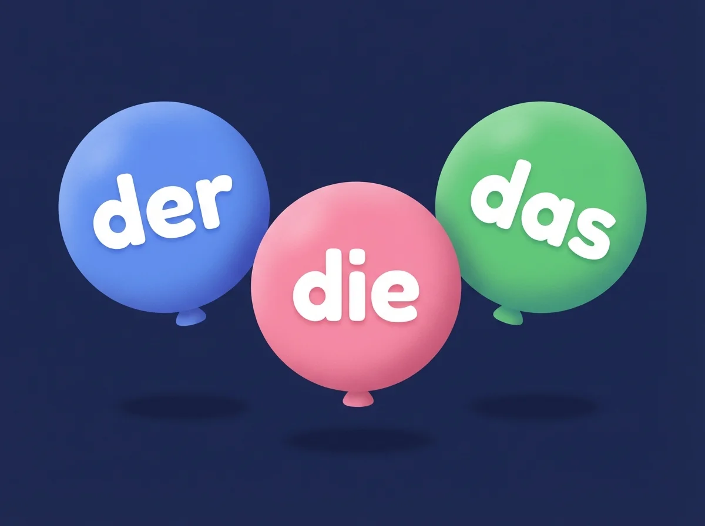

# Doiti - German Grammar Practice

<p align="center">
  
</p>

<p align="center">
  A free, offline app to practice German grammar. Works on Android and the web.
</p>

<p align="center">
  <a href="https://bruno1308.github.io/doiti/">Try it in your browser</a>
</p>

---

## Practice Modes

The compact **Pocket Decks** menu opens Overall A1, Overall A2, Conversation,
and a filterable library of all 19 grammar modes. Quick focus shortcuts jump
straight to common topics. Warm paper cards and raised answer buttons carry
through every activity, Settings, and session summary. Multi-gap cards show
four choices for the active gap, advance to the next empty gap, and let you
revisit any gap before checking. Conversation separates blue dialogue from
amber objectives and keeps answer-revealing explanations behind a solved reply
or an explicit reveal.

<table>
  <tr>
    <td align="center"><br/><b>Der/Die/Das</b><br/>Learn noun genders</td>
    <td align="center"><br/><b>Adjective Endings</b><br/>Master adjective declension</td>
    <td align="center"><br/><b>Case Identification</b><br/>Identify grammatical cases</td>
  </tr>
</table>

- **303 curated German nouns** (101 masculine, 102 feminine, 100 neuter)
- **30 adjective-noun pairs** with 20 sentence templates
- **25 annotated case sentences** for case identification
- Immediate feedback on answers
- Progress tracking (stored locally)
- No account required, no internet needed

### Overall A1 and Overall A2

Two mixed grammar categories offer **3,037 exercises: 1,644 A1 and 1,393 A2**,
adapted from throughout the supplied *A-Grammatik* workbook:

- Fill one or several gaps by choosing from four options per gap.
- Choose conjugated verbs, including separable verbs and both parts of the Perfekt.
- Choose an answer and get an explanation after checking.
- Drag sentence pieces into numbered slots, swap placed pieces, or return them to
  the bank. Tapping and keyboard activation provide an alternative to dragging.

Opening a grammar or Overall deck immediately starts **20 mixed cards**. The
**Settings** tab saves a length of 5, 10, 15, 20, 30, or 50 cards and lets you
include any combination of answer choices, gaps, conjugations, sentence puzzles,
and matching. Preferences apply to the next session and persist on this device.
Only relevant, selected types are mixed; small decks use fewer cards without
repeats. If a deck has no matching types, it links to Settings. Conversation keeps
its scenario menu and five objectives per scenario. Sessions prioritize unseen
and weaker exercises. English translations are offered where available,
mistakes can be reviewed at the end, and each level has its own
progress and History entries. Existing saved progress is preserved.

The bank includes 2,917 distinct workbook adaptations plus the original 120
questions. Duplicate workbook questions retain all page references. Open-ended
group discussions are not automatically graded. The PDF, artwork and audio are
not bundled into the app. See [the content notes](docs/overall-practice.md) and
[page-by-page coverage](docs/book-coverage.md).

## Progress

The Progress tab (formerly History, still reachable at `/history`) includes a
local Monday–Sunday activity trail, a suggested next grammar deck, three small
milestones, and a collection of 20 skills. Review recommendations put specific
missed cards first and respect the exercise types and length saved in Settings.
Recent sessions remain available in a collapsible log.

Explored counts unique answered cards. Familiar requires three recent correct
attempts; older records use at least three attempts and 80% accuracy until enough
new outcomes exist. Skill labels are practice signals, not proficiency grades.
Shared workbook cards contribute to each relevant skill and count once in the
collection totals. Daily activity is saved independently of the 20-session log;
older activity is recovered only from dates present in that log.

## Getting Started

### Prerequisites

- [Node.js](https://nodejs.org/) 20+
- npm (comes with Node.js)

### Install dependencies

```bash
npm install
```

### Run on the web (development)

```bash
npm run web
```

Opens a local dev server. Works in any modern browser.

### Run on Android (development)

```bash
npx expo start
```

Then press `a` to open in an Android emulator, or scan the QR code with Expo Go on your phone.

### Build Android APK (cloud)

Requires [EAS CLI](https://docs.expo.dev/build/introduction/) and an Expo account:

```bash
npm install -g eas-cli
eas build -p android --profile preview
```

This builds an installable `.apk` file in the cloud.

### Build Android APK (local)

No cloud service needed. Requires [JDK 17](https://adoptium.net/) and the [Android SDK](https://developer.android.com/studio) (or Android Studio).

```bash
# 1. Set environment variables (adjust paths to your setup)
export JAVA_HOME=/path/to/jdk-17
export ANDROID_HOME=/path/to/android-sdk

# 2. Generate the native android project
npx expo prebuild --platform android --clean

# 3. Build the APK
cd android
./gradlew assembleRelease
```

The output APK will be at `android/app/build/outputs/apk/release/app-release.apk`. Transfer it to your phone and install.

> **Note:** The `android/` directory is generated by prebuild and is in `.gitignore`. You can use `assembleDebug` instead for a debug build that's auto-signed and easier to install.

### Build for web (production)

```bash
npx expo export --platform web
```

Produces a static site in the `dist/` folder, ready to deploy anywhere.

## Deployment

The web app auto-deploys to [GitHub Pages](https://bruno1308.github.io/doiti/) on every push to `main` via GitHub Actions.

### Install on your phone

Visit the live website in Chrome on Android. When Chrome makes installation
available, the Home screen shows **Install Doiti**. You can also use Chrome's
menu and choose **Install app** or **Add to Home screen**. Chrome controls the
timing of its installation offer; it may require a tap and a short visit first.
On iPhone, use Safari's Share menu and **Add to Home Screen**.

The installed website uses the owl icon and opens in its own window. It uses
the existing website and local progress storage; no account or app-store
download is needed. Installation does not add offline caching: loading the
website still needs an internet connection.

The manifest and icons are in `public/`, and `app/+html.tsx` links them on every
page using the configured GitHub Pages base path. The installation banner is
web-only, hides in standalone mode, and appears only on Home when the browser
provides a real install prompt. It never interrupts an exercise.

## Tech Stack

- **React Native** + **Expo** (managed workflow)
- **TypeScript**
- **Expo Router** for navigation
- **react-native-web** for browser support
- **AsyncStorage** for local progress tracking
- **GitHub Actions** for CI/CD

## Project Structure

```
doiti/
  app/                    # Expo Router screens
    (tabs)/
      index.tsx           # Home dashboard
      gender.tsx          # Der/Die/Das quiz
      adjectives.tsx      # Adjective endings exercise
      cases.tsx           # Case identification exercise
    _layout.tsx           # Root layout (responsive web wrapper)
  components/             # Shared UI components
  data/                   # Bundled data files (nouns, adjectives, cases)
  lib/                    # Utilities (types, declension, stats, quiz logic)
  constants/              # Theme colors and spacing
  assets/images/          # App images and icons
```

## Contributing

Contributions are welcome! Some ideas:

- Add more nouns, adjective pairs, or case sentences to `data/`
- Add new exercise types (e.g., verb conjugation, preposition practice)
- Improve the UI/UX
- Add accessibility features
- Add more languages

### How to contribute

1. Fork the repository
2. Create a feature branch (`git checkout -b feature/my-feature`)
3. Make your changes
4. Test on both web (`npm run web`) and mobile (`npx expo start`)
5. Commit and push
6. Open a pull request

## Data Sources

- German nouns: curated from [gambolputty/german-nouns](https://github.com/gambolputty/german-nouns) (CC-BY-SA-4.0)
- Adjective templates and case sentences: hand-crafted
- Overall A1/A2: newly authored exercises following the grammar topics and task
  formats in *A-Grammatik: Übungsgrammatik Deutsch als Fremdsprache*, Anne Buscha
  and Szilvia Szita, SCHUBERT-Verlag (2010); local reference: `book.pdf`.

## License

This project is open source. Data files are licensed under CC-BY-SA-4.0.

## Focused practice

All 19 focused modes now use the same no-typing experience as Overall practice.
They include sentence dragging, clickable answers, and matching boards for
comparisons, opposites, and similar meanings. Existing exercises and progress
are preserved, and book-question progress is shared across modes.
See [the focused practice rollout](docs/focused-practice.md) for coverage and controls.

Conversation adds ten everyday scenarios with five objectives each. Build replies
word by word using four choices per slot, correct mistakes, and follow the dialogue.
See [Conversation practice](docs/conversation.md).
